<div align="center">



[](https://react.kmnapps.xyz)

[](https://react.kmnapps.xyz)
[](https://nodejs.org)
[](LICENSE)
[](https://github.com/mymyanmarland/808-react/pulls)

**Mimo-style React learning app — fully in Burmese 🇲🇲**
**Mimo လို အဆင့်ဆင့်သင်တဲ့ React သင်တန်း — မြန်မာလိုချည်းပဲ ✨**

</div>

---

## ✨ Features

| | |
|---|---|
| 📖 | **Bite-size lessons** — concept → code → quiz → fill-in-the-blank → playground, one smooth flow |
| 💻 | **Real runnable code** — every example runs live in a sandboxed in-browser JSX playground (React 18 + Babel, zero server execution) |
| 🧪 | **Free playground** — experiment with anything, `console.log` captured live |
| ⚡ | **Gamification** — XP per step, levels, 🔥 daily streaks (Asia/Yangon), progress dashboard |
| 🔑 | **Accounts** — email + password, or passwordless **OTP login** via email code |
| 📱 | **Mobile-first** — designed phone-first, dark React-themed UI |
| 🇲🇲 | **100% Burmese** — every explanation, quiz and hint in Myanmar language |

<div align="center">



</div>

---

## 🎓 Curriculum — 6 modules · 15 lessons · 106 steps

| Module | Lessons | Steps |
|---|---|---|
| **1. React စတင်ခြင်း** | React ဆိုတာဘာလဲ · ပထမဆုံး Component · JSX အခြေခံ | 22 |
| **2. Components & Props** | Component ရေးနည်း · Props ပေးပို့ခြင်း · Children Props | 21 |
| **3. State & Events** | useState · Event များ ကိုင်တွယ်ခြင်း · 🔨 Counter Project | 20 |
| **4. Lists & Rendering** | Lists & Keys · Conditional Rendering | 14 |
| **5. useEffect & Data** | useEffect အခြေခံ · API က Data ဆွဲခြင်း | 14 |
| **6. Mini Projects** | 🔨 Todo App · 🏁 အဆုံးသတ် Challenge | 15 |

---

## 🛠️ Tech Stack

<div align="center">

[](https://github.com/mymyanmarland/808-react)

**Node.js** + **Express** + **`node:sqlite`** + vanilla JS — no build step, no framework, deploys anywhere.

</div>

---

## 🚀 Quick Start

```bash
git clone https://github.com/mymyanmarland/808-react.git
cd 808-react
npm install
node seed.js     # load the Burmese curriculum (6 modules / 15 lessons / 106 steps)
node server.js   # → http://localhost:3015 ⚛️
```

**Email OTP** (optional) — set `RESEND_API_KEY` to deliver real login codes via [Resend](https://resend.com):
```bash
RESEND_API_KEY=re_xxx OTP_FROM="808 React <noreply@yourdomain.com>" node server.js
```
Without a key, OTP runs in dev mode (code logged to server console). `OTP_DEBUG=1` echoes the code in the API response — tests only, never production.

**Run the test suite** (35 API tests — auth, curriculum, XP/streaks, OTP, answer secrecy):
```bash
node test-api.js
```

---

## 📁 Project Structure

```
808-react/
├── server.js          # Express API — auth, OTP, XP/streak engine, lesson APIs
├── db.js              # SQLite schema (users, sessions, curriculum, progress, otps)
├── seed.js            # curriculum loader (wipes + reseeds from JSON)
├── mailer.js          # Resend email sender (dev-mode fallback)
├── curriculum/        # 🇲🇲 the Burmese curriculum — part1/2/3.json
├── public/            # dashboard · lesson player · playground · profile · auth
│   └── runner.js      # sandboxed iframe JSX runner (React 18 + Babel via CDN)
├── assets/            # ✨ animated SVG art for this README
└── test-api.js        # 35 end-to-end API tests
```

<div align="center">



</div>

---

## 🤝 Contributing

PRs welcome! Ideas: more lessons (hooks deep-dive, router, state management), English toggle, leaderboards, PWA offline mode.

## 📄 License

MIT — free for everyone to learn and share. 🇲🇲

<div align="center">


**[🚀 Start learning now → react.kmnapps.xyz](https://react.kmnapps.xyz)**

</div>
